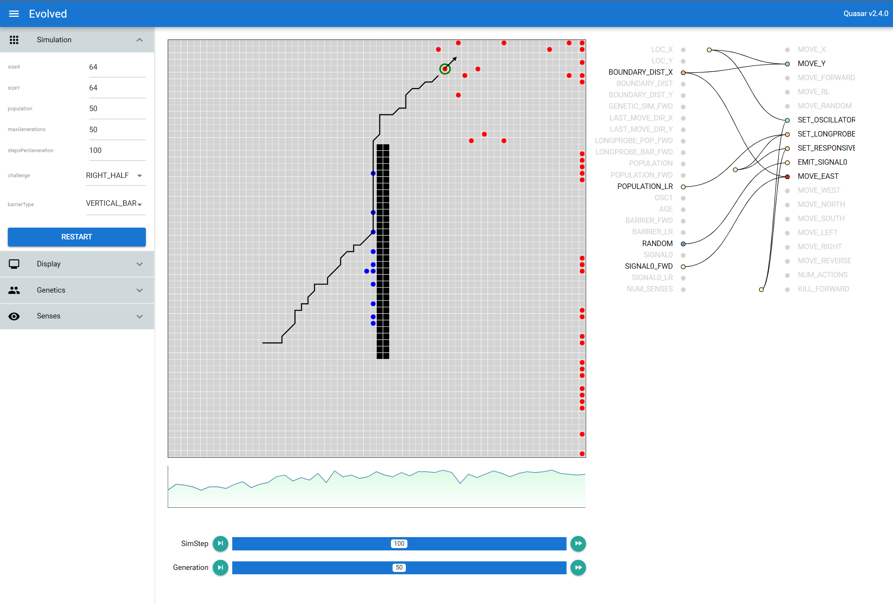

# Evolved

Typescript Webapp version of David Miller's [biosim4](https://github.com/davidrmiller/biosim4)

## TODO

1. ~~Challenge selection UI~~
2. Inheritance tests
3. Mutation tests
4. ~~Survivor and score graph~~
5. ~~Simulation reset~~
6. Obstacle paint
7. ~~Show signals~~
8. Allow genomes of different number of genes
9. ~~Online webapp~~

## References

1. [David Miller's BioSim4](https://www.youtube.com/watch?v=N3tRFayqVtk&ab_channel=davidrandallmiller)
1. [Quasar.dev](https://quasar.dev)
1. [D3](https://d3js.org)
